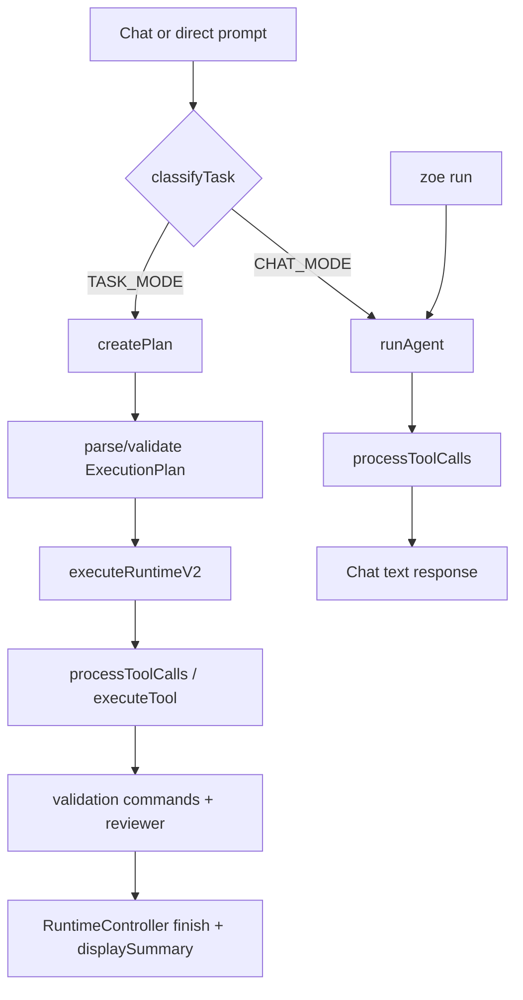

# Zoe CLI — Runtime and Agent Pipeline Audit (ZOE-004)

## Executive summary

Zoe has two production AI execution paths. Task-mode chat uses a structured planner, `RuntimeController`, Builder/tool processing, command validation and Reviewer. `zoe run <prompt>` invokes the conversational `runAgent()` path directly and prints success after a response, bypassing plan, runtime controller, structured verification and reviewer. This entry-point divergence is the principal confirmed runtime risk.

## CURRENT BEHAVIOR

### Entry-point map

| Entry point | Path | Planner | Controller | Reviewer | Final owner |
|---|---|---|---|---|---|
| `zoe <prompt>` / interactive task | `chat.ts → createPlan → executeRuntimeV2` | Yes | Yes | Yes | `RuntimeController` plus `displaySummary` |
| Explanation/chat | `chat.ts → runAgent` | No | No | No | agent/chat text |
| `zoe run <prompt>` | `run.ts → runAgent` | No | No | No | `run.ts` prints completion |
| `zoe scan` / `/scan` | `scan.ts → scanProject` | No | No | No | scan handler |
| direct terminal input | `chat.ts → executeTerminalCommand` | No | No | No | command handler |

`run.ts` exists but is not registered in `src/cli/index.ts`; it is a legacy/dead path in the shipped command surface, but remains callable if imported. There is no `/build` command. `/scan` only gathers intelligence.

### Intent, workspace and planning

`task-mode.ts` deterministically returns `CHAT_MODE` or `TASK_MODE` from regex signals. `chat.ts` also keeps its own legacy `isTaskRequest()` and keyword arrays, but routing uses `classifyTask()`: duplicated/dead classification responsibility. Task mode cannot change mid-run. Ambiguous requests default to chat, so coding requests can be missed by heuristic classification.

`createPlan()` obtains `getProjectDescription`, tech stack, file summary, destructive paths, `createProjectSnapshot`, and `extractUserIntent`. Scanner ignore rules exclude common build/dependency folders but context collectors differ in ignore sets; snapshots are not refreshed after writes. Planner returns strict JSON validated by `execution-plan.ts`, repaired once for malformed output and once for constraint errors. The plan is re-parsed before execution but is not persisted or immutable at a tool-call level.

### Execution, permissions and tools

`executeRuntimeV2()` owns the structured task path and creates both `RuntimeController` and legacy `ExecutionRuntime`. Builder is model output interpreted by `processToolCalls()`; there is no separate Builder module. The canonical registry is `tools.ts`; `executeTool()` normalizes aliases, validates Zod arguments, requests permission and invokes a tool. Direct terminal commands in chat bypass `executeTool()` and its permission system. Tool output is returned to the model with truncation; tool errors are mostly strings. Shell tool timeouts exist but no abort/cancellation propagation exists.

File writes are workspace-restricted and backed up. `edit_file` uses exact-match/ambiguity checks. Writes are synchronous, not transactionally coordinated; a multi-file task can remain partial after failure. Tool execution can install packages or run commands when model output asks; permission is per capability level and session-global for “always”.

### Verification and review

Structured execution discovers package scripts, runs selected validation commands, verifies plan requirements/files, hashes planned files and calls a model reviewer. Failed validation, blocking review, missing requirements/files, zero writes or pending controller work prevents `SUCCESS`. Repair attempts exist in the controller but `executeRuntimeV2()` does not perform a bounded automatic repair loop. The chat/`runAgent` path has only tool-result feedback and an honesty text guard; it has no controller-level verification or reviewer.

### Failure, cancellation, memory and observability

`RuntimeController` has typed internal statuses (`IDLE`, `ANALYZING`, `PLANNING`, `EXECUTING`, `VERIFYING`, `REPAIRING`, terminal states); `ExecutionRuntime` uses a different status set. Chat maps task errors through one shared renderer after ZOE-003, but command and tool layers still convert many errors to strings. No ESC/SIGINT/AbortController handling was found. Shell child processes and model streams are not cancellable, partial writes are not rolled back, and no task checkpoint/resume exists.

`memory.ts` writes prompt/plan/response messages before final verification in some paths; `session.ts` is a separate unused-by-agent JSONL abstraction. Workspace intelligence and snapshots can become stale during a task. Controller events are in-memory plain records with timestamps, but no task id, durable event log, step-running state or structured diagnostic export exists.

## Responsibility matrix

| Component | Classification | Current responsibility | Gap / duplication | Recommended owner |
|---|---|---|---|---|
| CLI command layer | DUPLICATED | dispatch and command-specific outcomes | `run.ts` diverges | canonical orchestrator entry |
| Chat interaction | CLEAR_OWNER | input and display | legacy classifier / terminal bypass | input only |
| Agent | AMBIGUOUS | chat, planner calls, Builder parsing, review orchestration | combines multiple roles | stable adapters |
| RuntimeController | CLEAR_OWNER | structured transitions/events/success gate | not used by chat/run | task state authority |
| ExecutionRuntime | LEGACY | parallel completion tracking | duplicates controller | migrate behind controller |
| Planner | CLEAR_OWNER | JSON plan generation/repair | not used in `runAgent` | planner adapter |
| Tools/executor | CLEAR_OWNER | schemas, permission, filesystem/shell | direct terminal bypass | sole mutating executor |
| Permissions | CLEAR_OWNER | prompts / session approvals | no task scope/audit log | policy authority |
| Reviewer | AMBIGUOUS | model review in structured task | no diff evidence/full tool results | verification gate input |
| Intelligence | AMBIGUOUS | scan/cache/context | collectors diverge | workspace snapshot owner |
| Memory/session | DUPLICATED | JSON conversation + JSONL helpers | no task state boundary | local context owner |
| Renderer | DUPLICATED | chat and command final output | multiple success/failure renderers | orchestrator result renderer |

## CONFIRMED DEFECTS

### ENTRY_POINT_DIVERGENCE — unverified `zoe run` execution path

- Evidence: `src/cli/commands/run.ts` calls `runAgent()` and prints `Task completed!`; `runAgent()` bypasses plan/controller/reviewer.
- Reproduction: invoke the module/command registration and request a file change.
- Impact: success may be reported without structured verification.
- Confidence: High.
- Fix target: ZOE-005 routes all AI task entry points through one orchestrator.

### PIPELINE_DUPLICATION — two runtime completion models

- Evidence: `RuntimeController` and `ExecutionRuntime` independently track pending steps/status in `runtime-controller.ts` and `execution-runtime.ts`.
- Impact: inconsistent success/failure truth and duplicate bookkeeping.
- Confidence: High.
- Fix target: ZOE-005 establishes one final outcome owner while retaining compatibility adapters.

### PERMISSION_BYPASS — direct terminal command path

- Evidence: `chat.ts executeTerminalCommand()` calls child-process `exec` directly; `tools.ts executeTool()` is the permission boundary.
- Impact: interactive terminal command execution does not receive tool permission checks.
- Confidence: High.
- Fix target: Status: Pending owner decision; likely ZOE-013 permission task, not ZOE-005.

### CANCELLATION_BUG / ROLLBACK_GAP

- Evidence: no ESC/SIGINT/AbortController runtime path; writes use backups but no multi-file rollback/task persistence.
- Impact: interrupted work can leave partial changes and cannot resume.
- Confidence: High.
- Fix target: ZOE-009 for persistence and a later dedicated cancellation task.

## UNCONFIRMED RISKS AND TESTABILITY BLOCKERS

- Reviewer semantic quality and live model tool-call behavior are unverified.
- Planner/Builder can receive different workspace views after mutations; no deterministic fixture proves stale-edit impact.
- No exported entry-point/orchestrator seam permits isolated tests for one final renderer, cancellation or direct command routing without production refactoring. **TESTABILITY_BLOCKER**.
- No production task id/durable event stream permits reconstruction of a failed preview task. **OBSERVABILITY_GAP**.

## TARGET BEHAVIOR (NOT IMPLEMENTED)

Proposed outcomes: `COMPLETED`, `COMPLETED_UNVERIFIED`, `PARTIALLY_COMPLETED`, `CANCELLED_BY_USER`, `PERMISSION_DENIED`, `PLANNING_FAILED`, `EXECUTION_FAILED`, `TOOL_FAILED`, `VALIDATION_FAILED`, `REVIEW_FAILED`, `CLOUD_UNAVAILABLE`, `AUTH_REQUIRED`, `INTERNAL_ERROR`.

## Exact ZOE-005 scope

Create one canonical task orchestrator and outcome adapter around existing Planner, Builder/tool registry, Reviewer and `RuntimeController`. Route structured AI task entry points through it; make it the sole final success/failure owner; reset per-task state; return one typed result to the renderer. Do not replace model/tool systems, add cancellation, change permissions, or alter memory persistence in ZOE-005.

## ZOE-005 resolution

Implemented via `task-orchestrator.ts` and `task-result-renderer.ts`; internal Planner/Builder/Reviewer/RuntimeController behavior was retained. Direct terminal-command permission bypass, cancellation and rollback remain deferred.

Deferred: device-code auth, package-install policy refinement, task resume, rollback, external connectors, terminal redesign and new agent frameworks.
